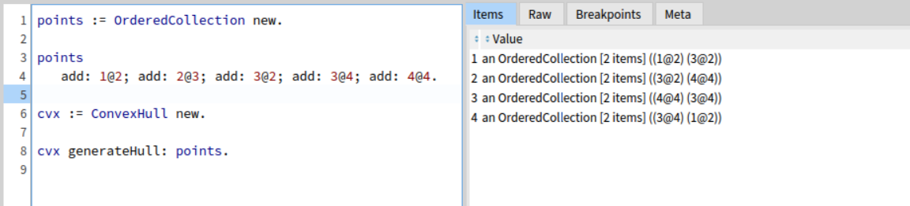

### Load Package
```
Metacello new
	repository: 'github://Cracen26/PHARO-ConvexHull';
	baseline: 'ConvexHull';
	load

```

### Convex Hull 
A set of 5 points generate convex hull composed by 4 segments based on [graham algorithm](https://muthu.co/understanding-graham-scan-algorithm-for-finding-the-convex-hull-of-a-set-of-points/).

```
points := OrderedCollection new.

points
	add: 1@2; add: 2@3; add: 3@2; add: 3@4; add: 4@4.

cvx := ConvexHull new.

cvx generateHull: points.
```

